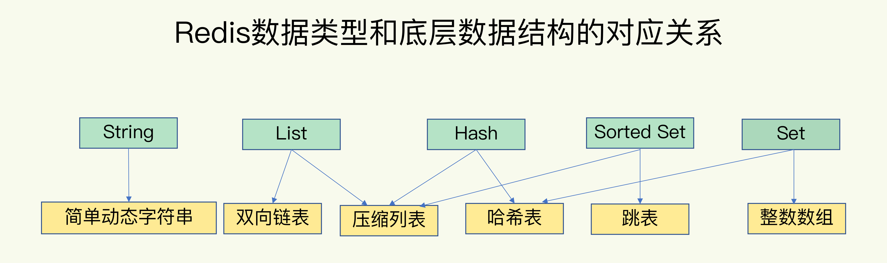

## 基础架构

Redis 由网络框架模块、基于不同的 value 值的操作模块、索引模块、存储模块（持久化 AOF/RDB）、高可用模块（主从复制/哨兵机制）、高可扩展模块（数据分片）组成。

（此处有个图就好了。）

## 数据结构

Redis 基本数据类型有：String、List、Hash、SortedSet、Set。

底层数据结构有：动态字符串、双向链表、 哈希表，跳表，压缩列表，整数数组。

为了实现从键到值的快速访问，Redis 使用一个哈希表来保存所有键值对。当写数据量大的时候，哈希冲突是不可避免的。解决哈希冲突办法：链式 Hash 和 rehash。

- 链式哈希：在每个哈希桶下面挂一个链表
- rehash：增加哈希桶数量（翻倍）

#### Redis 中怎么处理哈希冲突的？

为了使 rehash 操作更高效，Redis 默认使用两个全局哈希表：哈希表 1 和哈希表 2。一开始，刚插入数据时，默认使用哈希表 1，此时哈希表 2 并没有被分配空间。随着数据逐步增多，Redis 开始执行 rehash，这个过程分为三步：

  1. 给哈希表 2 分配更大的空间，例如当前哈希表 1 的两倍；
  2. 把哈希表 1 中的数据重新映射并拷贝到哈希表 2 中；
  3. 释放哈希表 1 的空间。

到此，我们可以从哈希表 1 切换到哈希表 2，用增大的哈希表 2 保存更多数据，哈希表 1 留作下次 rehash 备用。

第二步涉及大量的数据拷贝，如果一次性把哈希表 1 中的数据都迁移完，会造成 Redis 阻塞，无法服务其他请求。故 Redis 采用了渐进式   rehash。每次写的过程中会顺带着把哈希表 1 中的一个哈希桶上的 entires。没有写请求时，后台会有一个迁移线程进行迁移的。

#### 压缩表

压缩表实际上类似于一个数组，数组中的每一个元素，对应保存一个数据。和数组不同的是，压缩表在表头有三个字段 zlbytes, zltail, zllen, 分别表示列表长度、列表尾的偏移量和列表中 entry 个数；压缩列表在表尾还有一个 zlend，表示列表结尾。

#### 跳表

跳表在链表的基础上，增加了多级索引，通过索引位置的几个跳转，实现数据快速定位。

## 高性能 IO 模型

Redis 单线程，主要是指 Redis 网络 IO 和键值对读写是由一个线程来完成，这也是 Redis 对提供键值存储服务的主要流程。但 Redis 其他的功能，比如持久化、异步删除、集群数据同步等，其实由额外的线程执行的。

#### Redis 为什么用单线程？

多线程编程模式面临共享资源保护的问题，降低了系统代码的易调试性和可维护性。

#### Redis 单线程为什么那么快？

1. Redis 的大部分操作在内存上完成，再加上它采用了高效的数据结构，如哈希表，跳表等。
2. Redis 采用了非阻塞 IO + IO事件通知的方式，使其在网络 IO 操作中能并发处理大量客户端请求，实现高吞吐率。

#### IO 复用机制 epoll, poll, select

 IO 复用的三种技术，select -> poll -> epoll。

我们先了解下，两种 IO 事件通知的方式，水平触发和边缘触发，它们常在套接字接口的文件描述符中：

1. 水平触发：应用程序可以随时检查文件描述符的状态，然后再根据状态，进行 IO 操作。
2. 边缘触发：当文件描述符的状态发生变化改变时，发生一次通知。这时候应用程序需要尽可能多地执行 IO，直到无法继续读写，才可以停止。如果 IO 没执行完，或因为某种原因没有来得及处理，那么这次通知也就丢失了。

根据水平触发的原理，select 和 poll 需要从文件描述符列表中，找出哪些可以执行 IO，然后进行真正的网络 IO 读写。最大的优点，对应用程序比较友好，它的 API 非常简单。缺点也很显而易见，应用程序使用 select 和 poll 时，需要对这些文件描述符进行轮询，请求数多的时候，比较耗时。并且 select 和 poll 还有一些其他的限制，select 使用固定长度的位相量，表示文件描述符的极客，因此会有最大描述符数量的限制，在内部检查文件描述符是用轮询的方法，处理耗时跟描述符数量是 O(N) 的关系。poll 改进了 select 的表示方法，去掉了最大描述符数量的限制，在检查文件描述符仍是轮询的方法。除此之外，应用程序每次调用 select 和 poll 时，还需要把文件描述符的集合，从用户空间传入内核空间，由内核修改后，再传出到用户空间。

epoll 很好解决了这些问题：

* epoll 使用红黑树，在内核中管理文件描述符的集合，这样，就不需要应用程序在每次操作时传入传出这个集合。
* epoll 使用事件驱动机制，只关注有 IO 事件发生的文件描述符，不需要轮询扫描整个集合。

## 持久化

目前，Redis 的持久化机制主要有两个机制：AOF 日志和 RDB 快照。

#### AOF 日志

Redis 先执行命令，把数据写入内存，然后把执行的命令写到日志中。有两个好处，不需要检查命令格式；不会阻塞写操作。

支持三种写回策略：

1. 同步写回
2. 每秒写回
3. 操作系统控制写回

由于记录的是写命令，故导致 AOF 日志非常大。Redis 支持 AOF 重写机制，就是只记录最后的值。AOF 重写是由后台子进程 bgrewriteaof 来完成的，这个过程不会阻塞主线程。

#### RDB 快照

内存快照，就是指内存中的数据在某一个时刻的状态记录。它是给全量数据做快照的。

Redis 提供了两个命令来生成 RDB 文件，分别是 save 和 bgsave。

-  Save：在主线程中执行，会导致阻塞。
- bgsave：创建一个子进程，专门用于写入 RDB 文件，避免了主线程的阻塞，这也是 Redis RDB 文件生成的默认配置。

Redis 借助操作系统提供的写时复制技术，在执行快照的同时，正常处理写操作。

简单来说，bgsave 子进程是由主进程 fork 生成的，可以共享主线程的所有内存数据，bgsave 子进程运行后，开始读取主线程的内部数据，并把它们写入 RDB 文件中。

此时，如果主线程和这些数据也都是读操作，那么，主线程和 bgsave 子进程相互不影响。但是， 如果主线程要修改一块数据，那么，这个块数据就会被复制一份。然后，主线程在这个数据副本上进行修改。同时，bgsave 子进程可以继续把原来的数据写入 RDB 文件。

假设每秒做一次快照，会带来两方面的开销：

- 频繁将全量数据写入磁盘，会给磁盘带来很大压力，多个快照竞争有限的磁盘带宽，前一个快照还没有做完，后一个又开始了，容易造成恶性循环。
- Bgsave 子进程需要通过 fork 操作从主线程创建出来，虽然，子进程在创建后不在阻塞线程，但是 fork 这个过程会阻塞主线程的。

#### 建议

根据不同的场景选用不同的方案：

- 数据不能丢时，内存快照和 AOF 混合使用；
- 如果允许分钟级别的数据丢失，可以只使用 RDB；
- 如果只用 AOF，优先使用 everysec 的配置选项，因为它在可靠性和性能之间取了一个平衡。

混合使用：简单来说，内存快照以一定的频率执行，在两次快照之间，使用 AOF 日志记录这期间的所有命令操作。

## 数据同步

Redis 提供了主从库模式，以保证数据副本的一致，主从库之间采用的是读写分离的方式。

- 读操作：主从库都可以。
- 写操作：首先到主库执行，然后主库将操作同步给从库。

**为什么要采用读写分离的方式呢？**

如果不采用的话，我们需要保证数据在其他副本上的一致，就要涉及到加锁，实例间协商是否完成修改等一系列操作，但这会带来巨额的开销。

**主从库如何进行第一次同步？**

第一阶段是主从库建立连接，协商同步的过程，主要为全量复制做准备。在这一步，从库和主库建立连接，并告诉主库即将进行同步，主库确认回复后，主从库间就可以开始同步了。

具体来说，从库给主库发送 psync 命令，表示要进行数据同步，主库根据这个命令的参数来启动复制。psync 命令包含了主库的 runID 和复制进度 offset 两个参数。

- runID，是每个 Redis 实例启动时都会自动生成的一个随机 ID，用来标记这个实例。当从库和主库第一次复制时，因为不知道主库的 runID，所以将 runID 设为 ?
- Offset，此时为 -1, 表示第一次复制。

主库收到 psync 命令后，会用 FULLRESYNC 响应命令带上两个参数，主库的 runID 和主库的目前复制的进度 offset，返回给从库。从库收到响应后，会记录下两个参数。

FULLRESYNC 响应表示第一次复制采用的全量复制，也是就是说，主库会把当前所有的数据都复制给从库。

第二阶段，主库将所有的数据同步给从库。从库收到数据后，在本地完成数据加载，这个过程依赖于内存快照生成的 RDB 文件。

具体来说，主库执行 bgsave 命令，生成 RDB 文件，接着将文件发给从库。从库收到 RDB 文件后，会清空当前数据库，然后加载 RDB 文件。（为了避免之前数据的影响）

在主库将数据同步给从库的过程中，主库不会被阻塞，仍然可以正常接收请求。否则 Redis 的服务就被中断了。但是，这些请求中的写操作并没有记录到刚刚生成的 RDB 文件中。为了保证主从库数据一致性，主库会在内存中用专门的 replication buffer，记录 RDB 文件生成后收到的所有写操作。

最后，也是第三个阶段，主库会把第二个阶段执行过程中新收到的命令，再发送给从库。具体的操作是，当主库完成 RDB 文件发送后，就会把此时 replication buffer 中的修改操作发给从库，从库再重新执行这些操作，这样一来，主从库实现同步了。

可用通过级联的模式，即一些从库跟从库连，从其他从库同步数据，以减轻主库的压力。

当主库网络断了，主库会把断连期间收到的写操作命令，写入 replication buffer，同时也会把这些操作命令写入 repli_blacklog_buffer 这个缓冲区。

Repli_blacklog_buffer 是个环形缓冲区，主库会记录自己写到的位置，从库则会记录自己已经读到的位置。当主从断的时候，从新连接时，PSYNC 命令会有从写的 offset。主对比自己写 offset，将中间的发给从库。

Repl_backlog_size 标记该环形缓冲区的大小，如果写速度太快，还没等同步给从库，就被覆盖掉了。

## 哨兵

哨兵其实是一个运行在特殊模式下的 Redis 进程，主从库实例运行的同时，它也运行，哨兵主要负责的就是三个任务：监控、选主、和通知。

监控：周期性地给所有的从库发送 PING 命令，检测他们是否仍然在线运行。如果从库没有在规定时间内响应哨兵的 PING 命令，哨兵会把它标记为下线状态；同样，如果主库也没有在规定时间内响应哨兵的 PING 命令，哨兵就会判断主库下线，然后开始自动切换主库的流程。

选主：我们一般把哨兵选择新主库的过程称为“筛选 + 打分”，先筛选出网络连接状态差的，然后根据从库优先级（slave-priority）、从库复制进度(repl_backlog_offset)以及从库 ID 号(从小到大)。任何一轮胜出者，则结束

通知：哨兵会把新主库的连接信息发给其他从库，让他们与主库建立主从关系，并进行数据复制。同时，哨兵会把新主库的连接信息通知给客户端，让他们把请求发到新主库上。

**哨兵挂了，主从库还能切换么？**

实际上，一旦多个实例组成了哨兵集群，即使有哨兵实例出现故障，其他哨兵还能继续协作完成主从切换的工作。

基于 pub/sub 机制，使哨兵和哨兵之间，哨兵和从库之间，哨兵和客户端之间就能建立连接了。哨兵通过投票来得到执行主从切换的权利。

## 切片集群

Redis 官方提供了 Cluster 集群解决方案。Redis Cluster 采用哈希槽来处理数据和实例之间的映射关系。在 Redis Cluster 方案中，一个切片集群 16384 个哈希槽，这些哈希槽类似于数据分区，每个键值对都会根据它的 key，被映射到一个哈希值中。

手动分配这个 16384 个哈希槽，如果分配不完，Redis 集群将无法正常工作。

客户端保存了映射关系，可能不是最新的，导致不是对应的实例，这时实例返回 moved 重定向命令。

#### Codis 的整体架构和基本流程

Codis 集群中包含了 4 类关键组件。

- Codis server：进行二次开发的 Redis 实例，其中增加了额外的数据结构，支持数据迁移，主要负责处理具体的数据读写操作。
- Codis proxy：接收客户端的请求，并把请求转发给 codis server。
- Zookeeper 集群：保存集群元数据，例如，数据位置。
- Codis dashboard 和 Codis fe：共同组成了集群管理工具，codis dashboard 负责集群管理工作，包括增删 codis server，codis proxy 和数据迁移。codis fe 提供了 web 界面供管理。

客户端直连 codis proxy，codis proxy 接收到请求，就会查询请求数据和 codis server 的映射关系，并把请求转发给相应的 codis server 处理。当 codis server 处理完后，会把结果返给 codis proxy。proxy 再返回给客户端。

codis 数据如何分布的，key 映射到 slot，slot 映射到 codis server。与 redis cluster 一样，区别在于，都在客户端；拆到 proxy 和 zookeeper。

Codis 迁移数据的时候，按照 slot 迁的，从源 server 每次发送 slot 里的一个数据到目标 server。目标 server 要给出确认。这时，源 server 才会删除该数据。一直重复上述操作，直到迁移完成。

Codis 支持同步迁移，同步的过程中，源 server 阻塞。异步有两个特点：

- 当源 server 把数据发给目的 server 后，就可以处理其他请求了，不用等目的 server 写完。目的 server 写完后，传 AcK 给源 server, 源 server 再删除，整个过程数据只可读
- 对于 bigkey 用每一条指令进行异步迁移，从而避免将大value 序列化。

## 参考资料

https://time.geekbang.org/column/intro/329

https://time.geekbang.org/column/article/81268